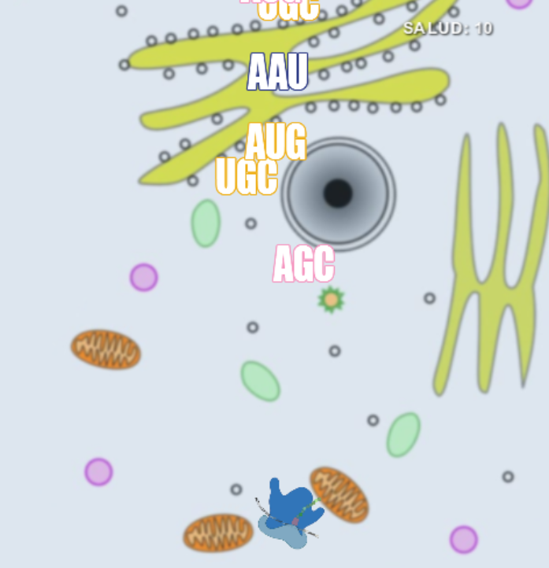

### Indicaciones del juego

# SINTETIZA BABOSA SINTETIZA

## Objetivo
El juego consiste en disparar aminoacidos desde un ribosoma (similar al space invaders) hacia los codones que aparecen desde la parte superior hacia la parte inferior aleatoriamente.
El ribosoma se desplaza en el eje horizontal con las flechas del teclado.
Cada tecla de la que presiones se corresponde con una aminoacido en particular utilizando el código uniletra como regla memotécnica.

Por cada acierto en la traducción incrementa la salud (el score). en caso de que un codón no pueda ser traducido, descuenta el score total que está representado por la salud.

