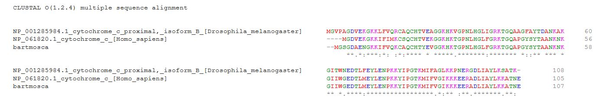
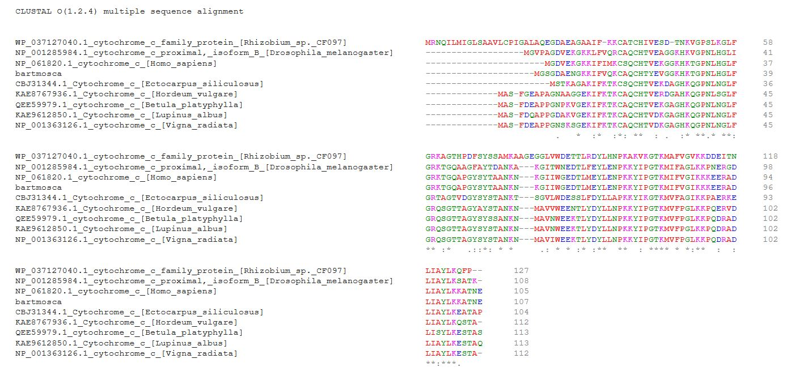

# TP 6

## Integrantes
* Cardozo, Carlos
* Luna Watkins, Ezequiel
* Marrero, Pablo

**RETO I: Detalla las tácticas y/o metodologías que deberían utilizarse para darles una respuesta a los padres del niño.**

**a)Dadas las secuencias de Mosca, humano y Moscahumano ¿Qué criterios se les ocurren para comparar las secuencias? ¿Qué resultados obtienen del análisis anterior?**

En una versión simplificada del proceso, en principio lo que realizariamos sería el análisis mediante la alineación y comparación entre las tres secuencias mencionadas. El resultado obtenido, derivaría en un árbol filogenético, el cual se encuentra resumido al confeccionarse considerando tan solo esas secuencias anteriormente mencionadas. 
Decimos que es una versión simplificada ya que tenemos uno bajo número de muestras participantes que se analizan para el mismo.

**b)¿Qué resultado esperaría obtener si utilizara el resto de las secuencias en el análisis? ¿Por qué?**

Para poder comparar a las secuencias de los tres organismos mencionados no basta con alinear y realizar la comparación entre las mismas, ya que esto no sería del todo preciso ni estaría mostrando el panorama real ni completo. 
Para poder obtener algo más parecida a la realidad, debemos comparar esta secuencia con varias secuencias de varias especies, por ejemplo, las secuencias de los mamíferos, donde estará la del humano, y con las de los insectos, donde estará la de la mosca, pero tambien existiran otras muchas especies. Esto visión, mucho más amplia, nos dará un árbol más grande donde veremos una distancia más correcta entre las secuencias de estas tres “especies” u organismos dadas. 
En pocas palabras a mayor cantidad de datos, podemos obtener una respuesta mucho mas precisa.

**RETO II: Como vimos anteriormente existen algunos softwares optimizados para confeccionar alineamientos de secuencias. En particular hemos trabajado con Clustal​(Larkinetal.2007)​. Confecciona los alineamientos para los del punto Ia y Ib análisis.**

**RETO III : Mediante el uso del servidor de ​IQtree ​(Trifinopoulosetal.2016)​, confecciona los árboles filogenéticos para los alineamientos obtenidos en el punto II.**

**a) Como vemos, el servidor nos permite elegir el modelo de sustitución ¿A qué se refiere?**

El modelo de sustitución está dado por lo que se conoce matrices de sustitución. 
Estas estructuras describen el ritmo al que un carácter en una secuencia muta a otro a traves del paso del tiempo. Sonutilizadas usualmente en el proceso de alineamiento de secuencias de aminoácidos o ADN, donde la similitud entre secuencias depende del tiempo desde su divergencia y los ritmos de sustitución según se representan en la matriz. 
Las matrices de sustitución se diferencian, principalmente, en los fundamentos para el cálculo inicial de las probabilidades de sustitución entre aminoácidos. Poder cambiar un modelo de sustitución permite el elegir el modelo de sustitución. utilizar otra de estas matrices, realizando una heuristica diferente, otro calculo y asi poder ajustarlo segun el tipo de input/output buscado.

**b)¿Qué es el Bootstrap? ¿De qué manera nos habla de la calidad de nuestro árbol? ¿Cómo influye el número de Bootstraps en el resultado?**

Bootstrap es unn tipo de medidas que permite evaluar el nivel de confianza de las ramas que se encuentran en un árbol filogenético, proporcionando fiabilidad y robustez. Es el método más utilizado para parsimonia y máxima verosimilitud.
El mismo se basa en la generación de una matriz de datos cuyas columnas se van transformando de forma aleatoria y a partir de cada una de las matrices resultados, crear un árbol filogenético, contando al final en cuantos de ellos aparece la secuencia a estudiar. 
Por último indica el porcentaje de veces en que cada nodo del árbol se presentó en las matrices remuestreadas. Al final todos estos árboles se representan en uno consenso donde aparecen los porcentajes de la proporción de cada réplica. Así, si una rama presenta más del 50% quiere decir que ésta es fiable.

**c) Interpreten los resultados obtenidos, mediante la visualización de los árboles con la herramienta​ FigTree​. ¿Es necesario realizar algún paso extra, previo a la interpretación del árbol? ¿Por qué? Podes instalarlo descargándolo desde:http://tree.bio.ed.ac.uk/software/figtree/**

Para interpretarlo mejor se puede acomodar de otra maneras los nodos para poder visualizar mejor los datos y la información encontrada. Podemos ajustar el zoom, el layout, la expansión y ver a distancia que hay de un nodo a otro, los labels y los porcentajes.